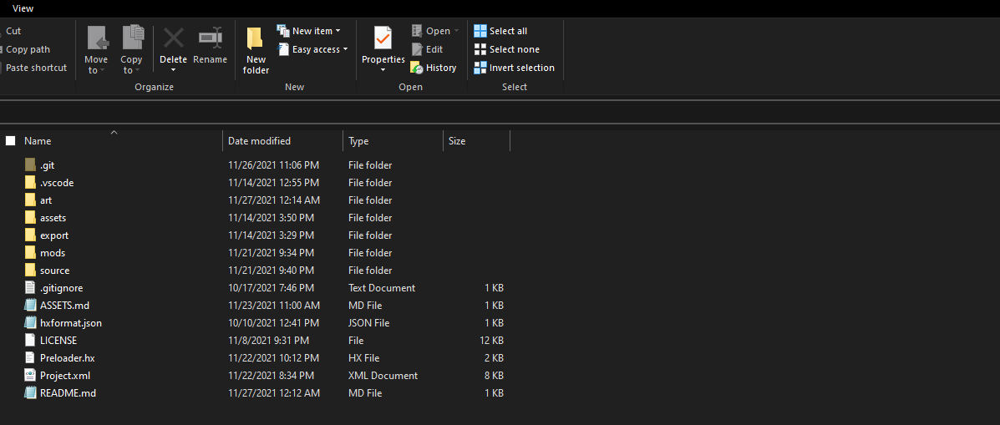
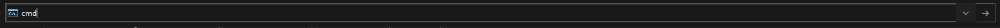

<p align="center">

</p>

# <p align="center">Hope Engine</p>

Hope Engine is an "engine" built from Kade Engine 1.5.2.

**100% in beta, expect bugs lmaoo**

---
## Building

Follow a compiling tutorial for Funkin (like [funkin-master](https://github.com/ninjamuffin99/Funkin)'s tutorial, etc..).

Then just `lime test windows` in your folder away!

### "what the FUCK does "lime test windows in your folder away mean"???"

"I wanna do it using the command line."<br>
awesome thing Ninjamuffinninetynine did: [Command line basics](https://ninjamuffin99.newgrounds.com/news/post/1090480)

Firstly, you have to open `cmd` or `powershell` in your folder first.

For starters, there's a way to easily access CMD within your folder.

Say you're in your copy's folder, like:


That's what you should be seeing. The address bar should be that thing at the top that shows you where you are in the files. Clicking on it would cause something like this to happen:


Next, replace everything in the address bar with `cmd` (or `powershell` if you prefer powershell)


Then, press Enter! It should launch `cmd` (or powershell if you put `powershell` instead) with the correct directory set. Then build by typng `lime test windows` and press enter.

### (for Visual Studio Code) Weird HScript Errors
I really have 0 clue why these errors happen, and these fixes are probably shitty fixes. These are some solutions I bruteforced on trying.
<br><br>

_**for Haxe extension users (and most likely uses Tasks for compiling)**_

Disable the compilation server in the settings (you can search for it, it's enabled by default), it will remove the `--connect 6000` when you compile from now on.
<br><br>

_**for Haxe completion feature users**_

There's another one where it somehow doesn't detect the `hscript` library?
Errors like `Type not found : hscript.Expr` showed up in the "OUTPUT" tab.

What I did was to use the git build.

```cmd
haxelib remove hscript
haxelib git hscript https://github.com/HaxeFoundation/hscript
```

---

## Credits
Built from Kade Engine by [KadeDev](https://github.com/KadeDev) with their [contributors](https://github.com/KadeDev/Kade-Engine/graphs/contributors).

Friday Night Funkin' by [ninjamuffin99](https://twitter.com/ninja_muffin99), [kawaisprite](https://twitter.com/kawaisprite), [PhantomArcade](https://twitter.com/phantomarcade3k), and [evilsk8r](https://twitter.com/evilsk8r).